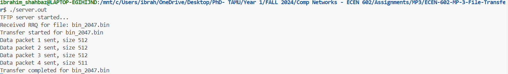

# ECEN-602-MP-3-File-Transfer

This project implements the Trivial File Transfer Protocol (TFTP) server. TFTP is tested on transfrerring different files between two a server and a client using the User Datagram Protocol (UDP). We have implemented the server side only, while for the client side we installed the tftp package (sudo apt-get install tftp-hpa) and used it to create client instances to perfom both Read Request (RRQ) and Write Request (WRQ) functions.

## Steps for execution

## Test Case Execution

1. **Transfer a binary file of size=2048 Bytes and check that it matches the source file.**
 
In this test case, a file of size 2048 Bytes is transfred from server to client directory and we check that it matches the source file.

**Client Side Terminal**

**Server Side Terminal**

**Client Side Directory Before & After**

**Files Comparison**

2. **Transfer a binary file of size=2047 Bytes**
 
In this test case, a file of size 2047 Bytes is transfred from server to client directory and we check that it matches the source file.

**Client Side Terminal**

**Server Side Terminal**

**Client Side Directory Before & After**

**Files Comparison**

3. **Transfer a netascii file that includes two CR’s**
 
In this test case, a netascii file that includes two CR’s is transfered from server to client, and we check that the resulting file matches the input file.

**Client Side Terminal**

**Server Side Terminal**

**Client Side Directory Before & After**

**Files Comparison**

4. **Transfer a binary file of size 34MB**
In this test case, we transfer a binary file of 34MB and see if block number wrap-around works.

5. **Try to transfer an invalid file**
In this test case, we check that we receive an error message if we try to transfer a file that does not exist and that our server cleans up and the child process exits.

6. **Transfer a file to three client simultaneously**
In this test case, we check that we receive the same file on three different client directories simultaneously.

7. **Terminate a client while recieving a file**
In this test case, we terminate the TFTP client in the middle of a transfer and see if our TFTP server realizes that the client got dissconnected after 10 timeouts.

8. **Bonus Feature: WRQ for a Binary file**
In this test case, we implement the WRQ bonus feature on a binary file.

9. **Bonus Feature: WRQ for a Netascii file**
In this test case, we implement the WRQ bonus feature on a netascii file.